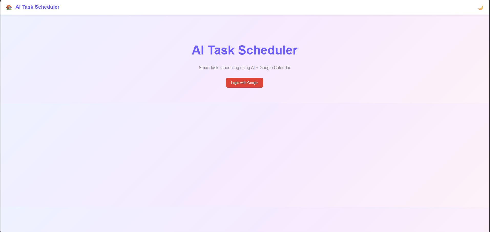
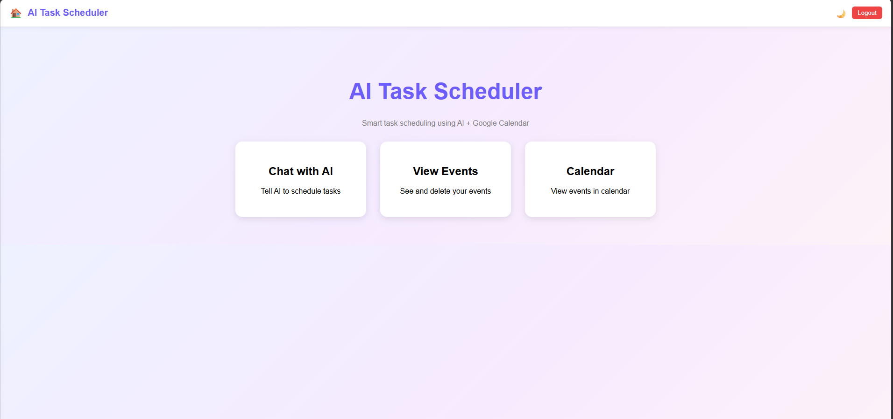
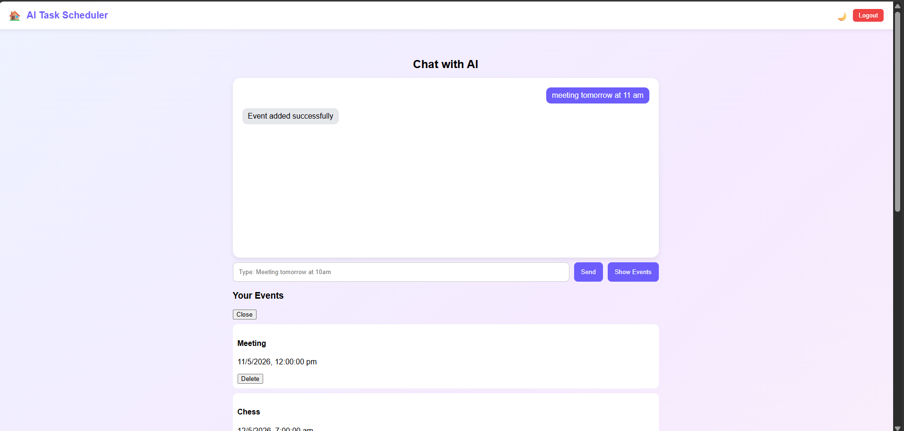
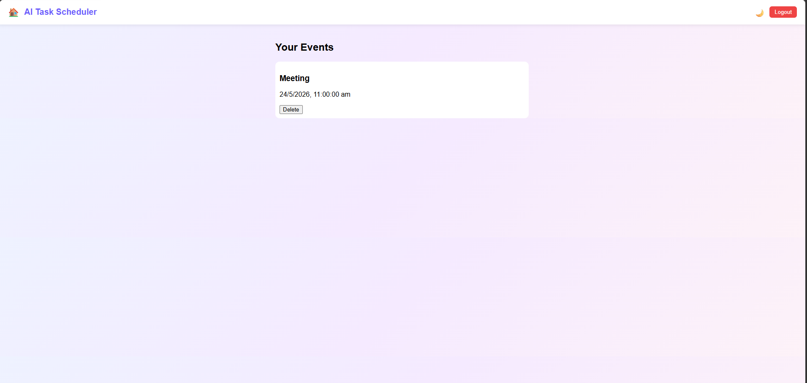

# AI Task Agent

An AI-powered productivity assistant built using React, FastAPI, Google Calendar API, Gmail API, and Groq AI.

---

# Features

- Natural language task scheduling
- Google Calendar integration
- Gmail email sending
- AI-based command parsing
- Smart schedule queries

---

# Example Commands

- meeting tomorrow at 10am
- what's my schedule tomorrow
- send an email to myself saying hello

---

# Tech Stack

## Frontend
- React
- CSS

## Backend
- FastAPI
- Groq API
- Google Calendar API
- Gmail API

---

# Project Structure

```bash
AI-TASK-AGENT/
│
├── backend/
├── frontend/
├── README.md
└── .gitignore
```

---

# Setup Guide

## 1. Clone Repository

```bash
git clone https://github.com/YOUR_USERNAME/basic-task-agent.git
cd basic-task-agent
```

---

# 2. Backend Setup

## Create Virtual Environment

```bash
cd backend
python -m venv venv
```

## Activate Virtual Environment

### Windows

```bash
venv\Scripts\activate
```

### Mac/Linux

```bash
source venv/bin/activate
```

---

## Install Dependencies

```bash
pip install -r requirements.txt
```

---

# 3. Create Groq API Key

1. Go to:
   https://console.groq.com/

2. Create an account

3. Generate an API key

4. Create a `.env` file inside `backend`

Example:

```env
GROQ_API_KEY=your_groq_api_key
```

---

# 4. Setup Google Cloud APIs

## Create Google Cloud Project

1. Go to:
   https://console.cloud.google.com/

2. Create a new project

---

## Enable APIs

Enable:

- Google Calendar API
- Gmail API

---

## Configure OAuth Consent Screen

1. Go to:
   APIs & Services → OAuth consent screen

2. Configure app

3. Add scopes for:
   - Calendar
   - Gmail
   - User Email

---

## Create OAuth Credentials

1. Go to:
   APIs & Services → Credentials

2. Create:
   OAuth Client ID

3. Application type:
   Desktop App

4. Download the credentials file

5. Rename it to:

```bash
credentials.json
```

6. Place it inside:

```bash
backend/
```

---

# 5. Run Backend

```bash
uvicorn main:app --reload
```

Backend runs on:

```bash
http://localhost:8000
```

---

# 6. Frontend Setup

Open another terminal:

```bash
cd frontend
npm install
npm start
```

Frontend runs on:

```bash
http://localhost:3000
```
--- 

# Screenshots 

## Home Page 
<p align="center">
  
  
</p>

## Chat UI



## Events Panel



# Future Improvements

- Voice assistant
- Notifications/reminders
- Better UI
- Deployment
- Mobile support

---
